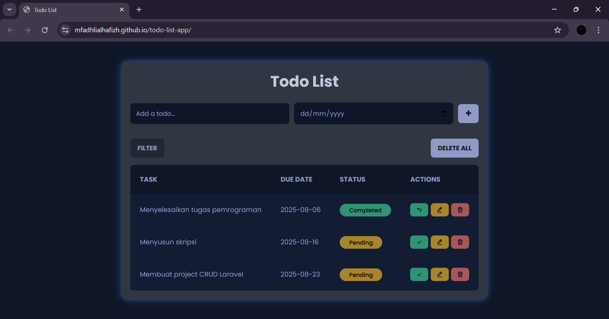

# ✅ Aplikasi Todo List

Aplikasi web **Todo List** sederhana dan responsif yang dibuat menggunakan **HTML**, **CSS**, dan **JavaScript**, serta mendukung penyimpanan data secara **permanen** melalui **Local Storage**.

---

## 📌 Tautan Aplikasi

🔗 [Coba Aplikasinya di Sini](https://mfadhlialhafizh.github.io/todo-list-app/)  

---

## 📋 Fitur

- Menambahkan tugas baru dengan tanggal jatuh tempo  
- Mengedit tugas yang sudah ada  
- Menandai tugas sebagai **Selesai** atau mengembalikannya ke **Belum selesai**  
- Menyaring tugas berdasarkan status (**Semua**, **Belum selesai**, **Selesai**)  
- Menghapus tugas secara individu  
- Menghapus semua tugas sekaligus  
- Tampilan antarmuka yang rapi dan interaktif

---

## 📁 Struktur Proyek

```
📦 TODO-LIST-APP/
├── 📁 css/
│ └── style.css
├── 📁 js/
│ └── script.js
├── index.html
└── README.md
```

## 🚀 Cara Menjalankan Aplikasi

1. **Clone** repositori ini dengan perintah:
   ```bash
   git clone https://github.com/MFadhliAlHafizh/todo-list-app.git
2. Buka file `index.html` di browser kamu.
3. Aplikasi siap digunakan untuk mencatat dan mengelola tugas!

---

## 🛠️ Cara Kerja Aplikasi

- Data tugas disimpan dalam array JavaScript (`tasks`)
- Tampilan akan diperbarui secara dinamis berdasarkan daftar tugas dan filter yang aktif
- Form input digunakan untuk menambahkan nama dan tanggal tugas
- Pengguna dapat:
  - Menandai tugas sebagai selesai/belum selesai ✅  
  - Mengedit tugas ✏️  
  - Menghapus tugas tertentu 🗑️  
  - Menghapus semua tugas sekaligus 🔥
- Filter tugas berdasarkan:
  - Semua tugas
  - Tugas yang belum selesai
  - Tugas yang sudah selesai

---

## 💡 Teknologi yang Digunakan

- **HTML5**
- **CSS3**
- **JavaScript (Vanilla)**
- **Local Storage** – Penyimpanan data di browser
- **BoxIcons** (untuk ikon tombol aksi)

---

## 📸 Pratinjau Antarmuka

> 

---
